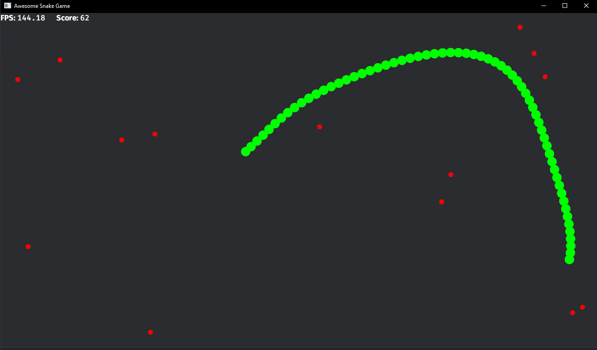

# Bevy Snake Game

A classic snake game built with [Bevy](https://bevyengine.org), a refreshingly simple data-driven game engine built in Rust.



## Some Features

- **Smooth Snake Movement:** Control the snake using your mouse.
- **Score Tracking:** Keep track of your score as you eat food items.
- **Audio Effects:** Enjoy retro sound effects for snake movements, eating, and game over.

## Getting Started

### Prerequisites

- Rust and Cargo: Ensure you have Rust and Cargo installed on your machine. If not, you can install them from [rustup](https://rustup.rs/).

### Running the Game

1. **Clone the Repository**

    ```bash
    git clone https://github.com/oererenn/bevy_snake.git
    cd bevy_snake
    ```

2. **Build and Run**

    ```bash
    cargo run
    ```

    This will compile the game and open a window where you can start playing immediately.

## Controls

- **Move:** `Mouse`
- **Stop Game:** `Esc`
